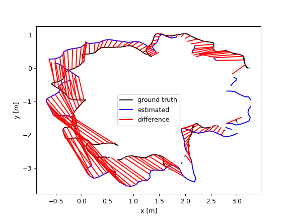

# Direct_RGB-D_SLAM

This is an implementation of a visual SLAM system performed on RGB-D images which consists of keyframe-based camera tracking through direct image alignment with relative entropy keyframe selection strategy, pose graph optimization and automatic loop closure detection.

Download TUM RGB-D dataset [fr2/desk](https://vision.in.tum.de/data/datasets/rgbd-dataset/download) and save them under the directory `rgbd_dataset_freiburg2_desk/`

The evaluation tool scripts `evaluate_ate.py` and `evaluate_rpe.py` downloaded from [TUM RGB-D benchmark](https://vision.in.tum.de/data/datasets/rgbd-dataset/tools#evaluation) are used to calculate the absolute trajectory error (ATE) and relative pose error (RPE) and plot the resulting trajectory.

Notice: Before running pose graph optimization, you have to run camera tracking first on a specific image scale determined by argument `level` to get the keyframe map. And before running PGO with automatic loop closure, you have to run automatic loop closure detection to generate loop closures file first.

##Run different algorithm with arguments
 
camera tracking with direct image alignment with keyframe selection strategy 1
```commandline
python main.py --tracking 1 --keyframe_selection 0
``` 

camera tracking with direct image alignment with keyframe selection strategy 2
```commandline
python main.py --tracking 1 --keyframe_selection 1
``` 

pose graph optimization with manually loop closure
```commandline
python main.py --pgo 1 --loop_closure 0
``` 

automatic loop closure detection
```commandline
python loop_closure.py
```

pose graph optimization with automatic loop closure
```commandline
python main.py --pgo 1 --loop_closure 1
``` 

output the optimized trajectory text file `your_trajectory.txt`
```commandline
python output_trajectory.py
```

plot the resulting trajectory
```commandline
python evaluate_ate.py rgbd_dataset_freiburg2_desk/groundtruth.txt your_trajectory.txt --plot PLOT
```


